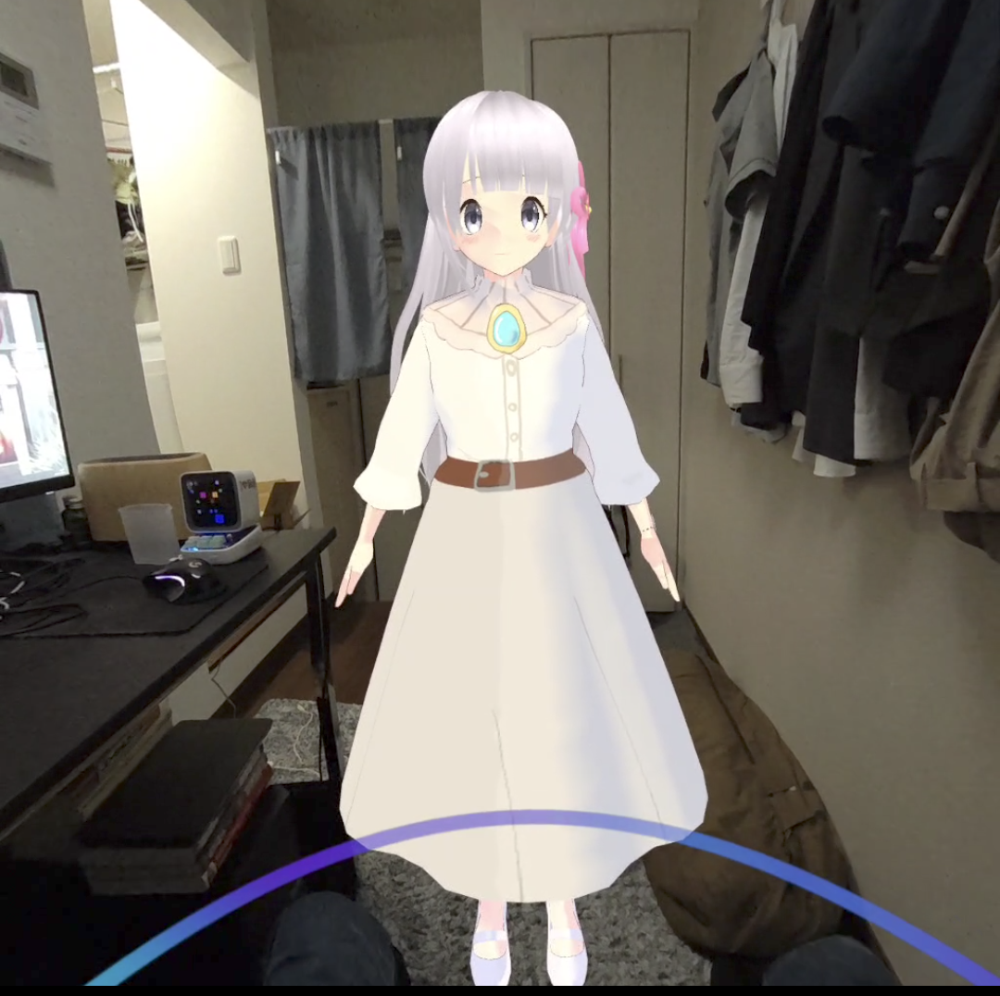
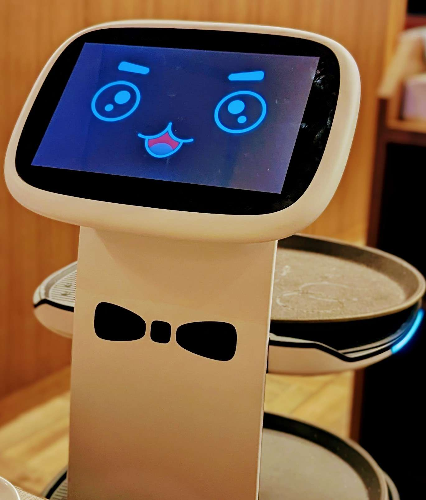

# 第二回 読書会 レポート 【前編】
- 第3章

あまりにも量が多くなったために3章を前編・中編に分割してお送りします。

# 読書会情報
## リンク
- 第一回
  - [前編](../Vol1/vol1.md)
  - [後編](../Vol1/vol1_after.md)
## アジェンダ
- 第３章 アンドロイド 機械はすべて人型になる
- 第４章 AI 機械は知性を持つか

## 参加者
- Pan (主催者): Ghostの先輩。哲学やオカルトに興味があり休日は古い映画を見に行くことが多い。好きな映画は「[ゼイラム](https://www.amazon.co.jp/%E3%82%BC%E3%82%A4%E3%83%A9%E3%83%A0-%E6%A3%AE%E5%B1%B1%E7%A5%90%E5%AD%90/dp/B012YFI9MO)」
- Ghost (副主催): 本ブログの著者。AIやVRといった先端技術や、音楽と折り畳み自転車が好き。最近は[aespa](https://aespa-official.jp/)にお熱

# 第3章 アンドロイド -機械はすべて人型になる-
## 取材先

- 石黒浩
  - 大阪大学大学院教授
  - 参照：https://nordot.app/427019537663722593

石黒先生と聞いて一番有名なのは自分そっくりのアンドロイドを開発していたことが記憶に新しい。

他にもタレントのマツコ・デラックスや夏目漱石のアンドロイドを開発、また演劇用ロボットである`ジェミノイドF`なども制作している。`ジェミノイドF`は舞台役者に対する細かい指示をそのままプログラムに書くことによって役者とロボットが同じ舞台に立ち踊るというものだ。

石黒先生は日本のアンドロイド(ヒト型ロボット)の研究における第一人者といっても過言ではない方だろう。

第1・2章では主に「SRシステム」の項では機械が生み出す虚構と現実の境目、「3Dプリンター」を軸としたアナログとデジタルの境界という観点から「`人と機械の境目`」を考察する内容であった。本項3章では`人とアンドロイド`という観点から上記テーマを著者と研究者が考察する章となっている。

※参考：ジェミノイドFについて 

リンク：[ヒト型ロボットの「人間化」　ゲーム活用がカギ：日本経済新聞](https://www.nikkei.com/article/DGXNASFK28012_Y3A820C1000000/)

---
**Pan** 「石黒先生はこの本の中だと一番有名人まであるよね」

**Ghost** 「実はウチの院の指導教員が石黒先生と元同僚とか言ってたんですよね。本当のことかは知らないですけどw」

**Pan** 「ああでも大阪の方だからそういう繋がりもあったのかもね」

**Ghost** 「漱石ロボットとかもこの人でしたよね」

※ 石黒先生は夏目漱石ロイドというもの開発していた 

リンク：[「ご無沙汰ですね」　漱石ロイドお披露目: Youtube](https://www.youtube.com/watch?v=lynh0g2Paqk)

**Pan** 「なんか蝋人形っぽいねｗ。でこの人が作った`ジェミノイドF`っていうのは舞台役者をロボット化したものなんだけど、舞台役者に対する指示ってこのシーンではここで何秒手を止めてとか結構細かいんだよね、それって翌々考えたらプログラムと同じで、それをプログラムに変換してアンドロイドに搭載してるらしいよ。」

**Ghost** 「巷でいう`ルールベース`っていうことですね。自分も言語処理でデータの前処理を行う際に実際にルールを決めてそれをプログラムに落とし込んで学習用データを作製することを研究でやってました。でもアンドロイドと言えば中にAIが入ってるイメージなので、そういうルールベースで動作してるってのは驚きです。」

**Pan** 「ジェミノイドとかは2005年だからね、まだそういう機会学習ブームも今よりは落ち着いていた次期だったと思う。」

## 人間こそが最強のインターフェイスである

### 最も理想的なインターフェイスは人

人は`人を人と認識する`という機能を持つ特性上、人の形をしたものの方が識別しやすい

そういうことで同じ形式をしているヒト型のロボットに興味を持ってしまうという。

石黒先生は「現代のスマホやPCは人間にとって理想的なインターフェイスでなく、最も理想なものは`人`」だと語る。世の中のデバイスは徐々に人に近いものになっていき、その究極形がアンドロイドだと。

筆者はそれに対し、「ペグ-イン-ホール」の実験より、人間が棒を穴に指す映像と機械が棒を穴に指す映像を子供に見せた時、子供は機械の映像を真似ずに人間の映像を真似るという結果から上記の事が裏付けられると語っている。

---
**Pan** 「人が何故ヒト型のロボットに興味を持つかっていうと、人は人を識別する機能をもってるからなんだって」

**Ghost** 「やっぱ安心感なんすかね」

**Pan** 「単純に人の形が脳で認識しやすいってだけなんじゃないかな?　でも究極なのかな?ってのは思うけどね」

**Ghost** 「先生も仰っている通り究極形、行きつく先はってことなんですかね。でも何かに指示を出すシチュエーションにおいては、機械に指示するよりも人型の方が安心感は出るかもしれないです。」

**Pan** 「確かにね、指示とかはね」

**Ghost** 「昨今は様々な業界で人手不足が言われていますけど、そういう解決案として最終的にはこういうヒト型のロボットを投入するんですかね」

**Pan** 「そういう力作業もそうだけど、やっぱ仕事内で決められたルールを遂行するってのが主な用途じゃないかな」

**Ghost** 「仮にですけど、アンドロイドが機械とかパソコンを操作するってなったら本末店頭ですよね」

**Pan** 「確かにねｗ」

**Ghost** 「ヒト型ではないですけど、Aiboとか本当にペットのように接してる人はいますよね」

※壊れてパーツ在庫問題から修理不可になり、文字通りの死を迎えたAiboの供養を実施する催しが開催された。

リンク：[AIBOの葬式に密着:日経ビジネス](https://business.nikkei.com/atcl/report/16/061100222/110900014/)

**Pan** 「ああ、SONYのね」

**Ghost** 「後はこの本か別の書籍かは忘れたんですけど、介護の現場で実際にヒト型のロボットを投入したらじいちゃんばあちゃんが意外とロボットと話をする回数が多かったって実験結果が出てるってのを見て、やっぱ人ってそういう暖かさを求めてたりするんですかね」

**Pan** 「介護か... 確かにね」

**Ghost** 「実はそういう意味で自分が作ってるAIツールを受肉させようって今こういう感じでやってますｗ」

※画面は開発中のものです

**Ghost** 「ひとまずはコンソール形式で進めていますけど、いずれはVR, またはAR空間上に出力できるように進めて行きたいですね。自分はロボット系は知見がないんで作れないんでこういうアプローチになってしまいますが...。 作れるならロボットも興味ありますけどね」

**Pan** 「いいじゃん、最近だと`人工モラルエージェント(artificial moral agent：AMA)`って言う、AIを如何に一人の独立したエージェントとして確立するか研究する分野もあるし。」

## 人間には心なんて存在しない

### 「心もないくせに心なんて言うんじゃないよ」

著者及び本記事の共同筆者であるPanは「人に心なんてない」が本章で石黒さんが主張したい本質的な部分であると考える。

石黒先生は「**人に心はなく、人は互いに心を持っていると信じているだけである**」と言う。
そこには石黒先生の幼少期の`怒る`という感情が沸かなかったという経験からきている。
怒ることはエネルギーを使うだけで無駄であり、そもそも人が何故怒るのか理解できない...

だが怒らなければいけない立場になり、練習してやっと怒れるようになっていった。結果行動すると感情が自然に芽生えてくることがわかった。

また、小学生時代には先生に言われた「人の気持ちを大切にしなさい」の意味がわからなかったという。
なぜなら、「人」「気持ち」「考える」のどれも定義を知らなかったから。  
大人になるということは「人」や「心」の問題にテキトーな折り合いをつけてわかったふうなことを言うことだと悟った石黒先生は、子供たちを前に講演するときは「大人の言うことを信用するな」と言っている。

---
**Pan** 「ここが一番、石黒先生がこの本で言いたかったことだと思う」

**Ghost** 「『心がない』 そう意識すると、人の感情も外部の要因から発生するもの、それって機械の入力を受け取って出力を吐くってのと同じに思える。そもそも`心`って何なんですかね」

**Pan** 「心ってのは多分宗教的なものじゃない? 本にも書いてあるけどあると思えば存在するっていう。」

**Pan** 「心があるかないかって話をすると頭でっかちって言われるけど、でも心がると信じてる人こそが心でっかちだって」

**Ghost** 「確かに」

**Pan** 「自分もこの本を読んでて、心なんて無い派に賛成かな」

**Ghost** 「感情って外部の刺激に反射的になってるだけかもって気が付いて、僕も無い派になりました。」

**Pan** 「感情も人間の内部の処理の生成物でしかない。石黒先生は本の中で怒ることが不思議で仕方なかったって言ってる」

**Ghost** 「分かります。仰る通りエネルギー使うし雰囲気も台無しになるし」

**Pan** 「そうだよね、人は大人になるにつれて`人`とか`心`の問題に適当に折り合いをつけてわかったふうなことを言い出すって言ってる。」

**Pan** 「でも世の中っていうほど怒るほど本気になることてなくないって思う。」

**Ghost** 「まあでも怒らない人って他人にも何事にも期待してないんだと思います。これは別の本に書いてあったんですけど、例えば朝起きて天気が雨だったとして、『なんで天気悪いんだ』って現実に発生する事象全部に感情を現にするとキリがない。そこでどんなことが起きても『これは自然現象なんだ』って割り切れば徐々に感情が沸いてくることは無くなるって言ってました。」

※ 参考図書 「[１日ひとつだけ、強くなる。　世界一プロ・ゲーマーの勝ち続ける64の流儀 (著)梅原大吾](https://amzn.asia/d/6IlbLan)」

**Pan** 「その考え方いいね! どんな事象も自然現象の一部だから自分で制御出来ないと考える。ある意味正常心を保つっていう。でも思ったけどそれって石黒先生のと逆の経験だね」

**Ghost** 「梅原さんっていう格闘ゲームのプロなんですけど、前見てた時本当に喜怒哀楽を出さない人でしたからね。曰く『感情に振り回され人は自分に負けてる』って」

## 人間に生きている価値など存在しない

### 俗世間を生きるための縛りをもたない

### 「人間が生きている意味は、自分が生きている意味を探す以外にないと思う。」

石黒先生は幼少期の経験から生きる事に執着心はなく、何をしていてもいいしむしろ死んでもいいから自分に言い訳のない生き方をしようと考えていた。

元々は絵描きやバイクに乗る生活を続けていたが、あるときに将来の不安に駆られ、そこから人工知能やロボットを触り始めたという。そして今も3年ごとに研究テーマを変更しているそうだ。

そういった柔軟性も俗世間を生きるための縛りを持たずに「死ぬ覚悟」を決めてやれば意外とできると

そして人は最初から価値のある人は存在せず、むしろ努力を辞めたいというのは死にたいと言っているのだと同等だと語る。

---
**Ghost** 「研究テーマを3年事に変えてるってすごいですね。自分は学部から院に入るときに研究室が変わった関係で分野も変わったんすけど地獄だったw」

**Pan** 「でも分野じゃなくってテーマを変えるってのはそこまでなんじゃないかな。」

**Ghost** 「でも確かに生きる意味って何なんですかね」

**Pan** 「この説は`世界の再魔術化`の話と密接に関わっていると思う。まず、近代哲学が確立された時期に`世界の脱魔術化`が起きて、例えば昔科学が発展してない時って自然現象、雷は神の怒りだって考えられていたけど、今は自然現象って原理が解明されて雷の発生自体に意味を考えることはなくなった。そう考えると科学が発展していくにつれて最終的には宗教、神の存在も否定されて『人が生きる意味』ってのは意味がないものになる」

※ 参考図書 「[デカルトからベイトソンへ ――世界の再魔術化 (著)モリス・バーマン](https://amzn.asia/d/5hWsE3D)」

**Ghost** 「雷なんてまさに字の成り立ち, 読み方の由来からそうですもんね。僕の出身の京都市の実家の近所に北野天満宮ってあるんですけど、元々立てられた理由が菅原道真っていう学問の神が九州の太宰府に飛ばされて、京都に帰りたくても帰れなくてついにそこで天寿を全うした。その祟りで平安京に雷が落ちまくって、それを収めるために天満宮を立てた結果、雷は収まった。」

※リンク： [清涼殿落雷事件: wikipedia](https://ja.wikipedia.org/wiki/%E6%B8%85%E6%B6%BC%E6%AE%BF%E8%90%BD%E9%9B%B7%E4%BA%8B%E4%BB%B6)

**Ghost** 「今の常識で考えたらたまたまゲリラ豪雨が立て続けに発生して雷が落ちたとも言える。そう考えると菅原道真の怒りという理由は消えてしまう」

**Pan** 「人の人生も意味を喪失したと言えるんだよね。そうすると人生のあらゆる事象に理由付けができなくなって、極端な例で言うと災害で子供を失ったお母さんが『なぜ私はこんなつらい思いをしないといけないのか』って嘆いても、それは偶然ですっていうしかなくなって。」

**Ghost** 「そこで宗教といった救いが必要になってくるんですね。やっぱ人には慰めが必要なんですね。」

**Pan** 「そうだね」

**Ghost** 「実は『それはあくまで偶然です』本があって、まあ統計学にその事象になる確率(p値)ってあってそれを現実の事象に絡めて説明するって本なんですけど、これ曰く全ての事象は確率的に起こった`偶然`と言えてしまうらしいですからねｗ」

※ 参考図書 「[それはあくまで偶然です:運と迷信の統計学 (著)ジェフリー・S．ローゼンタール](https://amzn.asia/d/4zDVPIc)」

**Pan** 「面白そうな本だね。そういうことで、人生に意味を持たせなきゃいけないって考えが`世界の再魔術化`。でも、もう世界的に支配力のある宗教は存在しないから個人で信じるものを信じて行きましょうって動きがそれで、結構この章と関連性があると思った。」

**Pan** 「要は無秩序な世界(`カオス`)に対して宗教で万物の存在意味を与えることで意味のある世界(`コスモス`)が成り立ってたけど、でも上の科学が発展した結果`コスモス`は成り立たなくなってきた。だから自分たちでカオスの中から生きる意味を見つけないといけないことになって、まあ自ら信じるものを見つけないといけなくなったっていうね」

**Ghost** 「今は確かに豊かになった半面無秩序であるともいえますからね」

## デパートで実際にアンドロイドを働かせてみた
実際に石黒先生はアンドロイドを高島屋で2週間働かせてみるという実験をされた。

その結果**売上高は前年度の同時期比の1.5倍**になったらしい。

理由としては下記が考察されている。
1. アンドロイドは嘘を付かないと思われている
2. ロボットをだからいつでも断れると思い簡単に接客に応じる

そうすることで新たな問題定義が発生する。まずアンドロイドの労働基準法はどうなるのかということと、そもそもロボットは「道具」として扱うのか、それとも新しい「人」なのか。

---
**Ghost** 「そういや牛繁っていう焼肉屋に前に行ったんですけど、そこで物をロボットで運んできたんがあって、まあペッパーくんみたいなもんなんすけど、中々可愛かったですね。」

飲食店では下記のような配膳ロボットが実際に稼働している。　

※参考：[ガストの「猫ロボット」成功のワケ　わずか1年半で3000店導入](https://www.watch.impress.co.jp/docs/topic/1501163.html)

**Pan** 「今はサイゼリヤとか田舎の飲食店って結構そういうのあるね」

**Ghost** 「労働基準法っていうけど、所詮機械だし適用されないんじゃないんですかね。客も人と思って接してる訳じゃなさそうだし」

**Pan** 「今はそうだけど、今後どんどん人の形をしていくうえでどうなるかだよね。やっぱルールとかあった方がやりやすいだろうし」

## そもそも「人間」の定義って?
### 技術は人間の進化の方法

昨今の科学技術は人間個人に寄り添ったものになってきており、その過程で「人間が機械に近づき、機械が人間に近づく」2つのベクトルが交わる点を考察しようというテーマに注目すると、石黒先生は「技術は人間の進化の方法だ」と語る。

人は技術を発展させることで自分を、更には人間の可能性をより引き出していく。

技術の発展が個人に寄り添うということは、人と機械の関係性は車が発明された時から変わっていなく、人と機械の境界はないのだという。

そういった意味でまず「人間」の定義に付いて考えることが一番だと石黒先生は言う。

石黒先生は「人に付いては何も定義されていなく、『考える』とか『意識がある』は曖昧過ぎて定義ではない」という。

また世界を代表するSF作家のウィリアム・ギブソンも「機械と人は融合するのか?」という問いに「人と機械は同じ」と答えている。

--- 

**Ghost** 「本当に人ってなんなんですかね？ 前にも行ったけど全部機械に置き換えたらそれって人なのって思います」

**Pan** 「やっぱ`振る舞い`じゃないかな、振る舞いがその人の通りだったらそれはその人だと思う」

**Ghost** 「確かに」

**Pan** 「この説では最近の技術は個人に寄り添っているのではないかって話題が出ていたよね。」

**Pan** 「最新技術との対比で、`グーテンベルクの印刷`が取り上げられていた。」

**Pan** 「でも、`グーテンベルクの印刷`の時点で技術は個人に寄り添っていると思っていて、それまでは印刷技術がなくて識字率も低かったから本は教会とかで人を集めて読み聞かせてってやってたんだけど、印刷ができて本を個人に届けられるようになってから黙読がうまれ啓蒙に発展した。」

※ 参考図書 「[哲学と人類 ソクラテスからカント、21世紀の思想家まで (著)岡本裕一朗](https://amzn.asia/d/7ZupDay)」

**Ghost** 「教会で読み聞かせてたって話もあるんですね。自分が知ってる話だと音楽の世界だとクラシック作曲家で有名なバッハの遺した楽譜を書き写しで複製していて、書き手によって内容のニュアンスが変わってきて本来の物とは異なるものになっていった。印刷ができてそれは無くなったんですけど、その書き写しで出来た楽譜を本来の形式に戻そうと復元したものをクリティカル版っていうらしいけど、本を出版する側という意味でも個人に寄り添ったと言えますよね。」

※ 参考図書「[バッハとの対話―バッハ研究の最前線 (著)小林 義武](https://amzn.asia/d/0C4qNTR)」

## ロボットと雇用
### 人間は他生物と自分たちを分けて特別だと思いたい

ここで人間の定義が出来ないと仮定すると、機械を「人」と捉えることも可能である。

人と機械の境界が無くなった時にロボットの人権を認めるか認めないかという問題が発生する。

石黒先生はこの見解に対し、「人間は他生物と自分たちを分けて特別だと思いたい、自分は機械よりも優れている。それは差別だと」, 「一つ一つのタスクを比較すると、殆どのタスクで人はコンピュータに勝てない、いずれ自分の存在価値を見失う人がくる」と述べる。

### ロボットに仕事を奪われると思ってる人は現状が変わらないと思ってる人だけ

コンピューターの発展によって上記の通り人が本来行う仕事を肩代わりすると考えることは容易い。実際昨今の生成AIの流れを見ていると人よりもAIの方が知識や創造の面で超えていることを実感する。

石黒先生は「雇用の心配をするのは現状が変わらないと思ってる人たちだけ、歴史を見ていったら仕事の種類自体大きく変わっている。今の視点で未来をみても仕方ない」と語る。

更にアメリカ、デューク大の研究者であるキャシー・デビットソンは2011年のニューヨークタイムズで「子供たちが大人になる頃、その65%はまだ存在していない職業に就く」と語る。

上記の事は自分(Ghost)でも実感できる。ほんの数十年前までは「Youtuber」や「プロゲーマー」、「インフルエンサー」と行った職業は存在しなかった。しかしこの急速な技術の発展の中でYoutubeや各種SNSといったプラットフォームが登場し、我々の生活は一変したと言っても過言ではないだろう。
そういった流れで動画や情報発信を行うことでもマネタイズできるようになり、上記の役職が誕生した。

以前プロゲーマーになった方が「たまたま今までやってきた自分の特技と時代がマッチした。本当に運が良かったと思う」と語っていたが、技術革新が進み次々と新たなサービスが生み出される未来、どのようなイノベーションが起こるのかは私にも想像が付かない。

また仕事の在り方も変わった。これまで仕事と言えば職場に出社してやるものという見方が強かったが、コロナをきっかけに多くの企業がリモートワークを導入した。
teamsやzoom、slackといったオンラインビデオ通話、チャットシステムを駆使することで場所を選ばずに業務を遂行することが可能になった。これらもソフトウェアに加えてインターネットや光回線といった情報通信網の技術発展が可能にしたものであり、数十年前まではあまり考えられていなかったはずである。

---

**Pan** 「ゲーム実況者とかあるけど、20年前とかじゃそういうので稼ぐなんて出来ると思われなかったんだよね。ゲームを1日中やっててお金が稼げるなんて」

**Ghost** 「youtubeとかSNSが個人に寄り添った技術ってのもあるでしょうね。前の話題と少し被るかもですけど」

**Pan** 「そうそう。更に10年後とかどうなってるんだろうね、怖いわ」

**Ghost** 「実は3Dのフードプリンタについて調べてたら`サイバー和菓子`ってのを見つけたんです。和菓子って季節によってその特有の形を作って、そういう季節感というものを楽しむってコンセプトで作られているんですけど、最近は異常気象でそういった季節を感じることができなくなってるそうなんです。そこで気象情報をAPIで取得して気候や気圧のグラフを作成、それを**3Dフードプリンタでお菓子の形式で出力して食べようっていう**。最初見た時は『何食ったらこんなの思いつくんや...』ってちょっとショックを受けました」

※リンク: [食べられる気象データ！？『サイバー和菓子』](https://note.com/flag_extech/n/n807769d89b9d)

**Pan** 「サイバー和菓子って名前のインパクト凄いよねｗ」

**Ghost** 「ほんとにｗ 今まで自分の常識だとそういう分析結果のグラフってコンソール画面、GUIのアプリ画面、Webブラウザ上っていう主に**画面から出力するもの**っていう固定概念に縛られていたんです。でも3Dプリンタがあれば確かに食品として出力できるし、何より気象データってのは季節によって変動するから、季節ごとに見た目も変化して和菓子のコンセプトから外れていないんですよね。」

**Ghost** 「まさしく技術の発展によって可能になったことですよね。もしかしたら近い未来、我々はお菓子の設計をしているかもしれない、気が付いたら和菓子職人になってるかもしれないって... まあ極端な例ですけどねｗ」

**Pan** 「ありえるかもしれないよね」

## 人を機械化する機械!?

### 人間=ロボット化システムの実用化
私(Ghost)はよく「やよい軒」や「日高屋」といった飲食店を利用する。

それらのお店では事前に食券販売のタッチパネルデバイスを通じて食券を購入する。あるいは席のタッチパネルより品物の注文を飛ばすと店員が持ってきてくれる。

一々メニューをひらいて店員を呼んでって流れがめんどくさく、無駄なやり取りが好きでない自分にとってはまさに便利すぎると言っても過言ではないシステムである。

石黒先生はこのようなものを「人間=ロボット化のシステムである。」と語る。

例えば接客のマニュアルがあるとすれば、その内容や手順はきめ細かく書かれているはずである。それらは言えば人に向けた指示(プログラム)とも言え、そういったマニュアルなどを機械に向けてプログラムに落とし込んでやれば機械も同様に上手く動かせることができるという。

更に石黒先生は「人間の行動は大まかに分割すると3つしかなく、『移動』, 『会話』, 『作業』に分けれる」という。確かにこれらの行動をプログラム化するのは不可能ではないのかもしれない。

---
**Pan** 「あと本の中でGoogleの社員が自分のマニュアルって、『自分はこういう風に操ると上手く行くからよろしく』的な内容ものをPDFで作製して社内全体に公開してるらしいけど、まさしく自分の扱い方っていうプログラムみたいなもんだよね」

**Ghost** 「自分も仕事で手順書とか書いたりしますけど、まあよくよく考えるとプログラムをしているのと同じなのかもしれないですね。機械には機械語や低級・高級言語で書く、人に向けては自然言語で書く、その違いしかない」

---
# 中編に続く... 