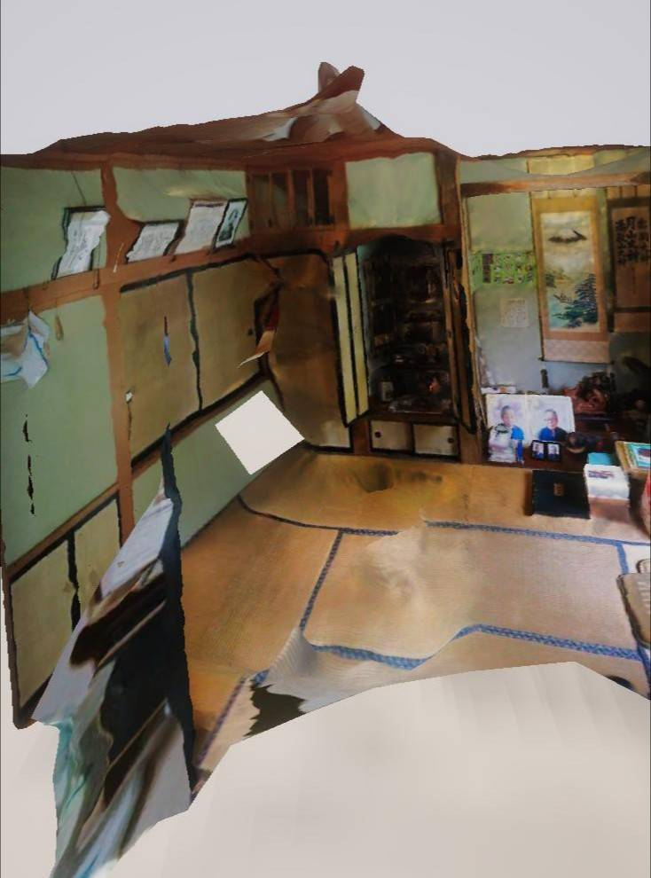

# 第一回 読書会 レポート 【後編】
- 第2章

# リンク
- [第一回 読書会 レポート 【前編】](https://github.com/ghostfm3/AI_HI_reading_work/blob/main/Vol1/vol1.md)

# 勉強会情報
## 書籍情報
題名：明日、機械がヒトになる ルポ最新科学

著者：海猫沢めろん

出版：講談社現代新書

リンク：https://amzn.asia/d/aO4CFTv

## 開催
9/1(金)  20:00～

## アジェンダ
- 第１章 SR 虚構を現実にする技術
- 第２章 3Dプリンター それは四次元ポケット

## 参加者
- Pan (主催者): Ghostの先輩。哲学やオカルトに興味があり休日は古い映画を見に行くことが多い。好きな映画は「[ゼイラム](https://www.amazon.co.jp/%E3%82%BC%E3%82%A4%E3%83%A9%E3%83%A0-%E6%A3%AE%E5%B1%B1%E7%A5%90%E5%AD%90/dp/B012YFI9MO)」
- Ghost (副主催): 本ブログの著者。AIやVRといった先端技術や、音楽と折り畳み自転車が好き。最近は[aespa](https://aespa-official.jp/)にお熱

# 第２章 3Dプリンター それは四次元ポケット
## インタビュー先
 - 田中 浩也
   - 慶応義塾大学 環境情報学部 教授
   - 参考：[Urban Fabrication Lab](https://fab.sfc.keio.ac.jp/)

本章では慶応義塾大学の田中先生との対談となる。先生の専門分野はデザイン工学、デジタルファブリケーション、3D/4Dプリンティング、環境マテリアルとなっている。

先生は日本に置ける3Dプリンターの普及につとめ、また`ファブラボジャパン`の発起人であり、日本とアジアにおけるファブラボやファブシティー推進の中心となっている人物である。

`ファブラボ`とは我々が使う道具を一般家庭にない3Dプリンターやレーザーカッターといった器具を用いることにより、ほぼ何でも作り出そうという活動内容である。

※参考: [What’s FabLab? (FabLab Japan)](http://fablabjapan.org/whatsfablab/)

## 3Dプリンターの概要
第2章では3Dプリンターとその周辺技術より「現実と機械の境目」を考察する章となっている。

3Dプリンターとは3Dデータを元に樹脂などを用いて立体的に造形出力する機器であり、昨今は一般家庭などにも導入されているような急速に自分たちの生活に入り込む技術の1つである。

本書が執筆された当時(2014年時点)での3Dプリンターの最前線としては主に食べ物を出力する`フードプリンタ`の他に`バイオプリンタ`といった細胞を直接噴射して臓器等を生成する医療の世界で使用されているものも登場する。

※参考

1. [生命を扱う「3Dバイオプリンティング」の世界、2020年の注目ニュースを振り返る (知的図鑑)](https://chizaizukan.com/news/53R2tFMWxPQyfky9ysUV0k/)

2. [フード3Dプリンターの現在と未来 ― できること・課題・展望 (ShareLab)](https://news.sharelab.jp/interviews/mitsuiwa-food3dprinting-230405/)

---

**Pan** 「3Dプリンターについては読み返した時に最先端技術とは外れてるかな?と思った。結構普及もしてて趣味で使ってる人もいるからね」

**Pan** 「その中でも今回紹介されてたフードプリンターとかバイオプリンターって結構マイナーっていうかあんま知られてない奴だよね」

**Pan** 「フードプリンタとかは実用化されてるものも一部あって、ケーキとかをペースト状にしたのを素材としてコピーするみたい。あとは医療の分野では医療食、介護食での利用が研究されているらしい。」

**Ghost** 「そうですね。俺もこの本読んで初めてフードプリンタとか知ったんで、ついに食いもん程度はコピーできるようになったのかって思いましたね」

**Pan** 「バイオプリンターってのがあんましイメージわかなくて」

**Ghost** 「確かに。あれですかね、臓器とかそういうものを...」

**Pan** 「多分。でもそれで作った臓器とかって動くのかな? でも過去の使用例としてプリンターで作った睾丸を移植した話は出てきたね」

**Ghost** 「巷の研究だとIPS細胞を用いて豚とかマウスとかの体内で生成した人間の臓器を逆移植するっていうのは聞きましたけど」

**Pan** 「そうそう、それで思ったのがバイオプリンターで人の臓器とか全部作れたらそれを組み合わせて人が印刷できるんじゃないかって」

**Ghost** 「それで例えば自分の臓器を全部置き換えたとしたら、それって本当に"自分"なの?　って思えますね」

**Pan** 「確かに自分って認識してるのってのはあるよね」

## つくったモノが勝手に動き出す?
3Dプリンタは主に3DCGやCADのデータをアナログ的に立体に出力する機械である。当初著者及び私(Ghost)も最初は本書の「人と機械い境界を探る」というテーマ内容とあまり関連性を想定できない、あるいは少し距離があるのではないか?と考えていた。

著者は以前3Dプリンターで最初に何を作るか?と知人に問いたところ、回答としては「3Dプリンタが壊れた時の為の予備の部品」という回答が返ってきて、`機械が自分で自分の部品を作る`すなわち自己複製を行うということは人並びに生物の定義であり、自己複製ができる3Dプリンタはまさしく「人の機械化ではないか?」と考えた。田中先生は「3Dプリンタ生物説」というのを定説している。

### 「3Dプリンタ生物説」
田中先生が「3Dプリンタ生物説」というのを定説した背景は、イギリスで`RepRap`というプロジェクトを拝見してからであった。

`RepRap`とはイギリス発祥の『3Dプリンタで3Dプリンタを作る』プロジェクトである。

※参考：[RepRap/ja (wiki)](https://reprap.org/wiki/RepRap/ja)

まさしく自己複製、コピーのように思われるが、田中先生は「3Dプリンタで3Dプリンタを複製する場合、全く同じものが作製されるわけではなく少しずつ改良が加えられていく。進化の過程みたいに変種や亜種ができていく」と語る。

目の前の機器も別の道具を用いて作られている。それをたどっていくとあらゆる道具の原点になった道具があるはず... 3Dプリンタはまさにそのような進化の過程をシミュレーションしているという。

### 4Dプリンタ

3D(3次元)は縦軸、横軸に加え高さを加味した空間であり、人間は普段3Dで空間を知覚している。

4D(4次元)となると上記の軸に更に1軸加えたものであり、人が知覚できない次元である。以前3D映画なるものが流行った際に「4D映画」というものが出ていた記憶があるが、その時は宣伝の謳い文句として上記の3軸に加えて「匂い」を掲げていた。が普通は上記軸に加えて「時間」という軸が加えられるのが一般的な4Dの考え方である。

3Dプリンタでは主に静的な物質、すなわち作製した後に変化も動作もしないモノが出力されていた。

`4Dプリンタ`は後から形や性質が変化したり、自律的にくみあがったりする、後から自律的に形が変わるものを出力する新種のプリンターであると田中先生は語る。

---

**Pan** 「3Dプリンタで3Dプリンターを複製すると、ドンドン改良が加えられていく」

**Ghost** 「樹形図みたいに枝分かれしていくって感じですよね?」

**Pan** 「そうそう、まるでどんどん生殖していく、それってもう生物じゃないかって」

## ペットボトルがAKB48の脚になる
### ソーシャル・ファブリケーションラボ
田中先生の活動拠点としては横浜中華街の近く、オフィスビルの一室にある、「慶応義塾大学SFC研究所 ソーシャル・ファブリケーション・ラボ横浜拠点」がある。ここで様々な研究・工作活動を実施されている。(2014年当時)

※参考：[ソーシャル・ファブリケーション・ラボ
Social Fabrication Laboratory (慶応義塾大学SFC研究所)](https://www.kri.sfc.keio.ac.jp/ja/lab/fablab/)

### 3Dプリンタで作ったモノ
物体の加工方式は`加算系`と`減算系`があり、3Dプリンターは前者に位置する。

3Dプリンターは樹脂を素材とし、次々と樹脂を重ねて行くことにより造形を行なっていく。下記動画は実際に3Dプリンターを用いた造形の例である。見て頂ければ造形方法をイメージできるだろう。

`youtube:https://www.youtube.com/embed/jUnOf7ZEi_4`

上記の逆として`減算系`はブロックや樹脂の塊を削りだしたり切り出したりして造形していく機器があたり、レーザーカッターやミリングマシンといったものが該当する。

ソーシャル・ファブリケーション・ラボでは3Dプリンターで展示用に作成された6本の腕をもつロボットアームである「ファブ・アシュラ」や本研究室所属の学生が作った「アイドルの脚」が展示されいる。これらはペットボトルを砕いて3Dプリンターの素材として再生して使用し作製されたものであり、冒頭にかいたタイトルもまさしくこの再利用の事を指している。

### 3Dデータの作り方
3Dプリンターでは3Dデータさえあれば素人でもどんなものでも作れると田中先生は語る。

データを作る方法は3つあり、1つは「CADで設計」、2つは「ネットに落ちてるデータを使用 (スミソニアン博物館など)」、3つ目は「3Dスキャン」等が上げられる。

※参考：[その数2,000点以上、スミソニアン博物館運営が著作権フリーの3Dモデル公開 (MoguraVR)](https://www.moguravr.com/smithsonian-museum-free-3d-model/)

3DCADに限らずに「blender」といった3Dモデリングソフト+3Dプリンターを使用したフィギュア制作等も現在ではよく聞く手法である。

様々なモノをデータとして取込み、蓄積していき、アーカイブ化しておくことは今後役に立つのではないか? と私(Ghost)は考えた。

自分は機械学習に触れることが多いが、そこで必要になるのも「学習させるためにラベル付けされた膨大なデータ」である。いざモデルを作ろうとした矢先に一番困るのはそういった膨大なデータであったりする。それは1日やちょっとで集められるものでもなく、ネット上に公開されているものも、数が少なかったり、ライセンスの問題があったりとすぐに使えるものでもないのだ。

3Dモデルに限らず画像, 映像, 言語データはあらゆる形式で収集し、蓄積していくことも一種の活動であると実感している。(実際にデータを収集しデータセットを構築するだけでも成果として扱われる。)

---
**Pan** 「3Dスキャン実はね、母方の実家を取り壊すときにスキャンしてて、それをモデル化してるんだよね」

**Pan** 「あとは近所のパン屋で買ったマフィンも3Dスキャンでモデルを取り込んだり」

**Ghost** 「これはいいですね」

**Pan** 「最近だとやっぱ3Dスキャンが主流かな~」

**Pan** 「iPhoneはユーザじゃないから詳しくないけど、カメラが3つ付いた世代から3Dスキャン機能が標準で入っているらしいし」

**Pan** 「androidでも“WIDAR”みたいな無料アプリで簡単に3Dスキャンできる。」

## デジタル+フィジカル=フィジタル
### 3DFAX
著者は3Dプリンタは情報と物質の境界を曖昧にするのではないか?と考えている。

著者は子供のころ「スルメは薄いしこれならFAXで送ることが可能ではないか?」と考えていたが、3Dプリンターの技術を応用すれば情報を送信先で物質化することが可能ではないかと考えた。

田中先生曰く実際に`3DFAX`が発売されるという。

`youtube:https://www.youtube.com/embed/ddvng2s-cy0`

FAXのラディカルな所は向こうから勝手に送られてくるということが挙げられ、3DFAXになるとスキャンデータが転送先に送られて実際に家に帰ったら3Dプリンターからお土産みたいなものが大量に送られてきたみたいなことが可能になってしまうと田中先生は言う。

すなわち物理空間が侵食されるというわけだ。

### 砂を使った数日で消滅する物を出力するプリンタ
上記のように物理空間を侵食されるということは思えば有難迷惑な話でもある。

その解決策としては何日かだけ存在して数日後に消滅する「消えてなくなる物質」の研究・作製が必要になってくると田中先生は仰る。研究室では日々学生と議論しながら上記について検討しているというが、その案としてまずは「砂」で実現しようと画策している。

イメージとしては3Dプリンターで砂を固めてプリントし、3日たったらまた砂に戻るという仕組みである。

### `フィジタル`を作りたい
先生は「さらさらした情報の世界」と「ごつごつした物質」の世界の中間の「さらさらした物質」という第三の世界を作りたいと考えている。

先生はそれを`フィジタル`と定義する。`フィジタル`は`Physical`と`digital`を掛け合わせて、オフラインとオンラインの世界を融合させる活動のことを意味する。

---

**Pan** 「生物と物質の境界では`フィジタル`って考え方があって。`さらさらした物質`の世界って。読んでて思ったのが情報の価値っていう話がでてきて」

**Pan** 「大学の情報倫理の授業なんかだとよく話題になるけど、`情報の価値`ってどうやってきまるのっていう。物質だったら原価であったり使ってる材料費とかであったりで決まるけど、情報の価値ってなるとファイルの容量とかで決まるわけでもないし、まさしくさらさらした感じで」

**Pan** 「で3Dプリンタってその情報を物体化するじゃん。で3Dスキャンだと逆に物体を情報化できるじゃん。その価値ってどうなるのっていう」

**Ghost** 「相互に変換した結果、価値って上がるのか下がるのかっていう」

**Pan** 「そうそう。例えば情報の価値っていう議論だと`お布施の理論`ってのがあって、檀家さんがお寺さんに支払うお布施みたいに情報も提供側と受領側が見合う金額の折り合いをつけて決める。じゃあそれで決めた価値ってこういう3Dプリンタとかスキャンとかに適用されるのっていう」

**Ghost** 「情報→物になる過程で、例えばその物を構成する素材とか製造過程で変わるってことですよね」

**Pan** 「そうそう」

**Ghost** 「なるほど。少しズレた話になるかもですけど、例えば情報の価値で言えば巷でよくソーシャルゲームのガチャに金払うのはもったいないっていう人いますよね。データに金払うのはないって。」

**Pan** 「確かに確かに。あれは何というか信仰心とか愛とか宗教に近いものだと思っていて。例えると「ごつごつした情報」っていうのかな。物はないけどそういう満たしてくれるデータを持ってるとかね」

**Ghost** 「言われてみれば信仰心とかそういう感じしますよね」

## 日本中の3Dプリンタで「銃」が作られた日
2014年に3Dプリンタで銃を作った大学職員を銃刀法違反で逮捕されている。

この時大学職員は`銃刀法違反`で逮捕されているが、これは制作した銃が殺傷能力があったために上記法が適用されたというわけだ。

ここで著者は「データ自体が違法か?」、もしくは「データを物質化したことが違法か? 」と曖昧性を定義していた。 それに対し田中先生は「『銃』の定義をどうするか問題」と語る。

銃を製造したという事件であれば直近では安倍晋三氏暗殺事件で犯人が銃を自作していたことが記憶に新しい。このように3Dプリンタに関わらず、製造方法がネットなどで容易に入手可であり、個人で銃や爆弾といった兵器を製造できる環境も問題視されている。

※参考：[安倍氏を撃った「自作銃」を検証　3Dプリンター製作の銃で過去に事件も、はらむ危険性　元刑事が解説](https://www.kobe-np.co.jp/rentoku/omoshiro/202207/0015499898.shtml)

---

**Pan** 「そういう意味だとこの3Dプリンタで銃が作られたって話があって、銃を作ったことが違反かそれともデータ自体が違反なのかっていう議論があって」

**Ghost** 「でもデータ自体に違法性はないですよね、銃を作ってもってしまったことで銃刀法違反って感じで」

**Pan** 「そうそう。本の中でも「何をやるかによる」って書いている」

**Ghost** 「確か本に書いてあった、身体の忌まわしい部分をプリンタで作って逮捕されたとかいうアホもいたそうですよね」

**Pan** 「作家のろくでなし子さん。アレ結構話題になってたんだよね」

**Ghost** 「あれって確かプリンタしたんじゃなくって3Dモデルを公開したからってだけで逮捕されたんですよね」

**Pan** 「そうだね。銃をつくった人も作家さんも日頃からSNSで過激な発言をしてて、警察も見せしめの意味も込めて逮捕したって話があってね」

**Ghost** 「なるほど、でも銃の話も作家さんの話も法律が違うからとしか言えないですよね。銃はそもそも所持したらアウトだし、作家さんの奴はデータを公開したら公然わいせつ罪にあたる。何を作るか、データ化するかですよね。」

**Pan** 「確かにそうだよね」

## テロリストが3Dプリンタで犯罪を起こす?

### デジタルディバイド
田中先生は「技術そのものを作る技術者と、それ以外の人々との間で技術への認識や情報量に格差ができてしまうことが危ない」と語ると同時に「メディアの人々には技術を報道する際にそのセンセーションな部分で煽るだけではだめでリテラシーを育んで欲しい」と語る。

人は『ポジションな情報よりもネガティブな情報の方に注意を向けやすく、かつ記憶にも残りやすい』という`ネガティブバイアス`という性質を持っている。

※参考: [ネガティビティバイアス ](https://imidas.jp/genre/detail/F-133-0080.html#:~:text=%5Bnegativity%20bias%5D&text=%E4%BA%BA%E3%81%AF%E3%83%9D%E3%82%B8%E3%83%86%E3%82%A3%E3%83%96%E3%81%AA%E6%83%85%E5%A0%B1,%E3%81%95%E3%82%8C%E3%82%8B%E5%82%BE%E5%90%91%E3%81%8C%E3%81%82%E3%82%8B%E3%80%82)

ネット上の記事もそういった人の性質を利用して、センセーショナルな情報を発信することも多く、技術的な報道であれば「○○が危険だ」とばかり報道されることも多い。先生は伝える側のリテラシーを今一度見直し、技術の情報を正確に報道すべきだと語る。

### 3Dプリンターの規制
3Dプリンタで銃が生成されたっといったセンセーショナルな報道が多くなれば、当然「3Dプリンタを規制すべき」という声が挙がってもおかしくはないだろう。

3Dプリンタに限らずに直近では生成AIでも企業や大学がその様々なデメリットより規制を課すというニュースを耳にすることが多い。どう活用するか?よりもその危険性といったネガティブな話題が議論されやすく、広がりやすい為に、結局「どう制限するか」とブレーキが掛かる方向に行きやすいのだ。

田中先生は「例として3Dプリンタが規制されたら、一般人は全力で3Dプリンタを手に入れようとしない反面、テロリストといったあらゆる方法を駆使してテロを起こしたい集団はあらゆる手段を駆使して3Dプリンタを手に入れようとする。そうなれば一般市民が3Dプリンタに触れて社会に良いことをもたらす可能性が消えてしまう。であれば規制はしない方が良い」と語る。

--- 
**Ghost** 「デジタルディバイドってやつですよね」

**Pan** 「そう。結局技術とかに大して理解の無い人が規制を推進してたりするよね」

**Ghost** 「3Dプリンタとてあくまで機械、物ですよね。物でしかない。それを規制しても意味はないと思いますね。銃とかはそれこそ人を殺すためのものですけど、3Dプリンタとかは兵器を作るためのものではない、あくまで作れるだけですもんね」

**Pan** 「そうそう。ちゃんと使えばだよね。そこら辺は社会ジレンマ的な問題で、例えば自動運転とかも事故っちゃった時に運転手の命か歩行者の命のどちらを優先するのって問題もあるし、そもそも責任はどうなるのって問題もある。」

**Ghost** 「そこが矛盾みたなもんすよね」

**Pan** 「矛盾してるよね。結局新しいものが出るたびに考えないといけないよね。NTTが思想研究所作ったのもうなずけるよね」

**Pan** 「技術の使い方とか内容とかよりもそういう倫理面とかぬけてるよね」

**Ghost** 「最近だとChatGPTとか画像生成モデルとかそういうこと言われてますよね」

**Pan** 「そうだね。技術で儲ければいいとか言ってる奴とかまさしくのそこが抜けてるよね。ここら辺はやっぱ技術者倫理としていい話だと思った。社会人ってやっぱ利益の上げ方とかは学ぶけど、技術者倫理ってなかなか学ぶ機会が少ないから大事だと思うね」

**Ghost** 「そこらも結構大多数がどう思うか? っていうのでも決まってくると思いますねえ」

**Pan** 「そうだね。功利主義いわゆる`最大多数の最大幸福`は昔からずっと研究されている理論だからね。」

## おばあちゃんの形見が2つある?
### 物語性・希少性のあるものは複製できる?
3Dプリンタで何でも作成出来るということは、「おばあちゃんの唯一の形見」といった物語性や希少性のあるものも複製できてしまうということである。がここで著者は`アウラ ※注1`が薄くなると考える。

※注1 `アウラ`：オリジナルの作品から失われる「いま」「ここ」にのみ存在することを根拠とする権威を表す言葉のこと

※参考: [アウラとは?](https://artscape.jp/artword/index.php/%E3%82%A2%E3%82%A6%E3%83%A9#:~:text=%E6%A9%9F%E6%A2%B0%E7%9A%84%E8%A4%87%E8%A3%BD%E3%81%AB%E3%82%88%E3%81%A3%E3%81%A6%E8%8A%B8%E8%A1%93,%E3%81%A8%E3%81%99%E3%82%8B%E6%A8%A9%E5%A8%81%E3%81%AE%E3%81%93%E3%81%A8%E3%80%82)

田中先生は「3Dプリンタで複製したものからは`アウラ`は消えてしまう。が、`アウラ`があるものの複製を目にしたとき、どういう感覚をもつのかという別の物語が存在し、そこを実験したい。従来の常識に囚われてはいけない」と語る。

### 3Dプリンタでつくったものはコピーではなく「抜け殻」
また田中先生は「3Dプリンタで作られたものは`コピー`ではなく`データの抜け殻`である。元のデータ自体はフローやアップデートを続けているが、3Dプリンタで出力したものは過去の痕跡でしかない」と言う。

著者はこの話と`データ的実像`の話が近いと振り返っている。(※第一回 前編を参照)

「結局、実態を感じるのはハードデータとバックアップデータが互いにアップデートをかけている瞬間ではないか?」  と著者は考察する。

--- 
**Pan** 「ここで出てきた`アウラ`って、1900年頃に思想家のヴァルター・ベンヤミンが“複製芸術論”で論じたものなんだよね。」

**Pan** 「1900年ってちょうど映像技術が発展した時期で、映画が大量に生産されていた。」

**Pan** 「その中には政府が自らの政治活動を美徳化して民衆を動員する目的のものも多くて、ベンヤミンはこの状況を批判するために`アウラ`を持ち出している。」

**Pan** 「ベンヤミンは技術の発展によって複製可能な時代になるにつれ、衰退していくものとして一回性、唯一性(=`アウラ`)を挙げている。」

**Pan** 「そして、アウラの衰退は芸術の分野を超えて広がってゆくだろうとも予見している。」

**Ghost** 「ようはオリジナリティーが無くなるってことですよね」

**Pan** 「そうそう、コピーにオリジナルの魂って宿るのかって。そこで考えられるのが物自体じゃなくてその"履歴"の方に魂が宿るって。だからコピーしても履歴の方は乗り移らないって」

**Pan** 「抜け殻の話についてはSRの話でも合った通り」

**Ghost** 「ああ繋がってるんすね」

**Pan** 「3Dプリンタで作ったモノってあくまでコピー時点でのものっていう」

**Ghost** 「なんか偽ブランド品みたいな話ですかね」

**Pan** 「確かに。その物体の情報に対してアップデートが掛かると認識も変わるのかもしれないよね」

**Ghost** 「なんかシュレーディンガーの猫みたいですよね。箱をあけるまで猫は生きてるか死んでるかわからない」

**Pan** 「そうだね。ってかそういうのプリンタでつくったらどうなるんだろうね」

## 医療と3Dプリンタ
### 3Dプリンタの発展が目覚ましい分野は医療
3Dプリンタで発展が目覚ましい分野は医療分野であるという。

1999年にアメリカのノースカロライナ州にある大学では3Dプリンタ(バイオプリンタ)で造られた膀胱の移植に成功している。

他には2000年に日本の中村真人氏が人間の細胞の培養液をインクとして使用する`3Dバイオプリンタ`を開発し、1年後には細胞を皮膚に噴射して治療を行うことに成功している。

ただし医療での分野は倫理・安全性の検証に時間がかかるそうだ。

他にも美容やエクストリーム・ファッションといった分野で先鋭的なものが出てくるかもしれないと田中先生は考察する。(例：甲殻類みたいな服を作るなど)

### 人間の感覚をアップデートさせなければいけない
先生はこういった3Dプリンタの技術が発展するごとに「人間中心の考え方に転換が強いられる」と考えられてる。

こういった3Dプリンタが自己複製を行うようになり、『機械と生物の境界が曖昧になる』と生物の定義といったところも今一度見直しが必要になる。そういったことで「人間の感性をアップデートさせて変化に対応していかなければいけない」と先生は語る。

---
**Pan** 「この辺は倫理の問題があるよね」

**Ghost** 「人の一部を作るわけですからね。宗教的にも問題ありそうですよね」

**Pan** 「そうだね」

**Ghost** 「こういうのを規制とかで潰したりすると、過去のアレクサンドリア図書館みたいな技術の進歩が失われるとかありそうですよね」

## 道玄坂のてっぺんで「ものづくり」
### FabCafe

渋谷道玄坂を登り切った場所に『FabCafe』というデジタル工作器具を使ってモノづくりを楽しむ空間がある。コ・ワーキングスペースとして利用する他にカフェとして飲食を楽しむことも可能である。

※参考: [fabcafe tokyo](https://fabcafe.com/jp/tokyo/)

このカフェの上に`ケインズデザインラボ`という会社がある(現在は移転済み)

ケインズラボは3Dスキャンや3Dモデリング黎明期から日本の3Dに関する様々な技術を広めてきた原雄司さんの会社である。

ここで著者は田中先生の取材後に本社に移動し、3Dフィギュアで自分の体を3Dスキャンしてフィギュアを生成した。

生成されたフィギュアを触っていた海猫沢氏だが、自分のフィギュアが欠けた際に自分(著者)の身体に気概が加えられたような気がしたと語っていた。

--- 
**Ghost** 「なんかフィギュアが欠けたって話、SRの話に通ずるもんがありますよね。外部から自分を覗くっていう」

**Pan** 「フィギュアの方は欠けた瞬間に自分の身体に危害を加えられた気がしたと書いている。SRの方だと逆に自分の身体が自分の物じゃない感覚になるっていう逆だね」

**Ghost** 「昔の人が写真撮られた時に魂抜かれたみたいなこと言ってるの思い出しました」

**Pan** 「確かに近いよね」

## 3Dプリンタが実現する「機械との競争」
### 機械との共存
田中先生は以前職人の方に3Dプリンタをお見せしたところ、「(作られたものに対して)こんなまがい物はダメだ」と返ってきた拒否するパターンと、出力したものに対して漆を塗り始めたハイブリットな形式のパターンに分かれたと振り返る。

上記の話を思い出して著者は「人間の機械化だけではなく、機械の人間化が人間らしさを更に増幅する方向性があるかもしれない」と考えた。

またケインズラボの原さんは「3Dプリンタで作ったパーツで人間をサポートする方向性を模索したい」と語る。

ただこういったテクノロジーの力で人が健常者以上の力を手に入れることはエンハンスメントなのか治療なのかが問題となる。

著者は田中先生のラディカルな思想と原さんの地に足が付いたビジネスの話を融合させる、すなわちテクノロジーをうまく融合させれば、「機械との競争」ではなく「機械との共存」が可能ではないか？と考察している。

--- 
**Ghost** 「若干本末転倒感ある」

**Pan** 「だよね。でも漆を塗るとかは機械はできないし、やっぱ人との共存か感じられるよね」

# 第2回に続く