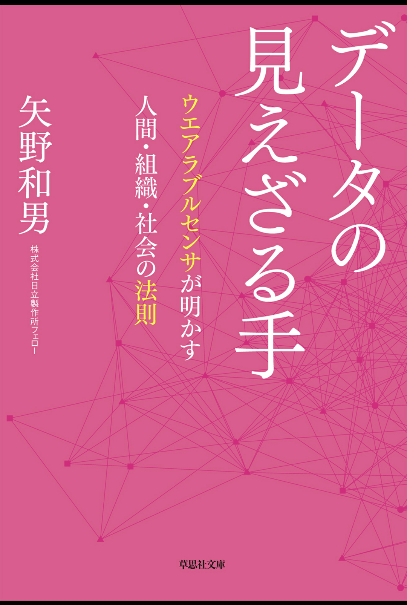

お疲れ様です。

DSもくもく会運営部のS.Kです。

今回は今自分が読んでいるデータ分析に関する書籍を紹介させて頂きます。

# 書籍紹介

## 書籍情報

**タイトル：** データの見えざる手 ウエアブルセンサが明かす 人間・組織・社会の法則 

**著者：** 矢野和夫 (株式会社日立製作所 フェロー)

[☞リンク](https://amzn.asia/d/1897Dtr)

## オススメポイント

著者の矢野さんは社内の実験として実験対象者にウエアブル端末を腕に装着してもらい、

収集した膨大なデータ(各個人の腕の動を動かす回数など)を分析することにより、法則性を見出したり、収集したデータの活用例などを紹介する書籍となっている。

特に「人間は一日の活動を自由に決定して行動している風に見えているが、実は時間の使い方は法則によって制限されている」ということが人間の活動による身体の動きのデータから導きだされていたというのが非常に興味深かった。

# おわりに
まだ読んでいる最中ですので、全てを語ることはできませんが如何でしたでしょうか。

ご興味を持たれた方は機会がありましたら是非読んでみてください!