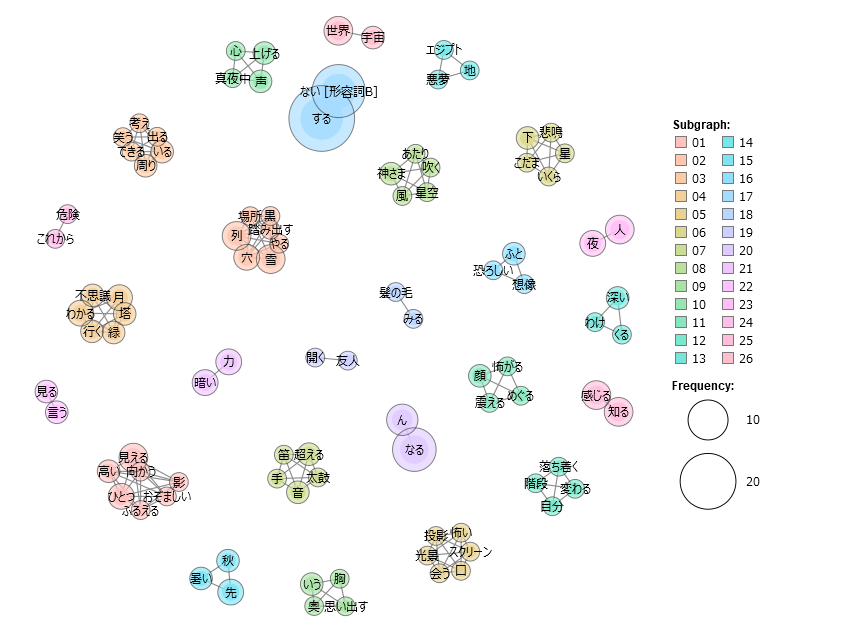
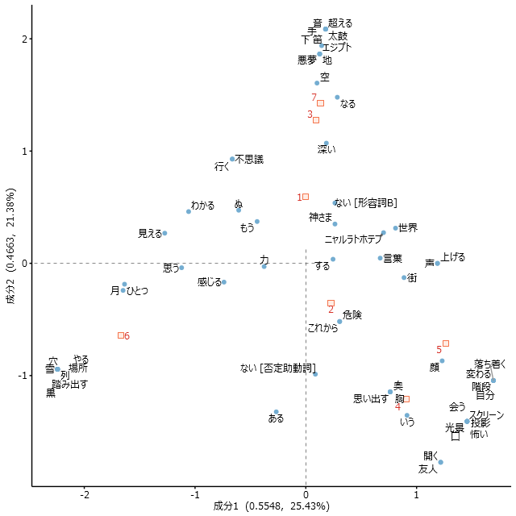
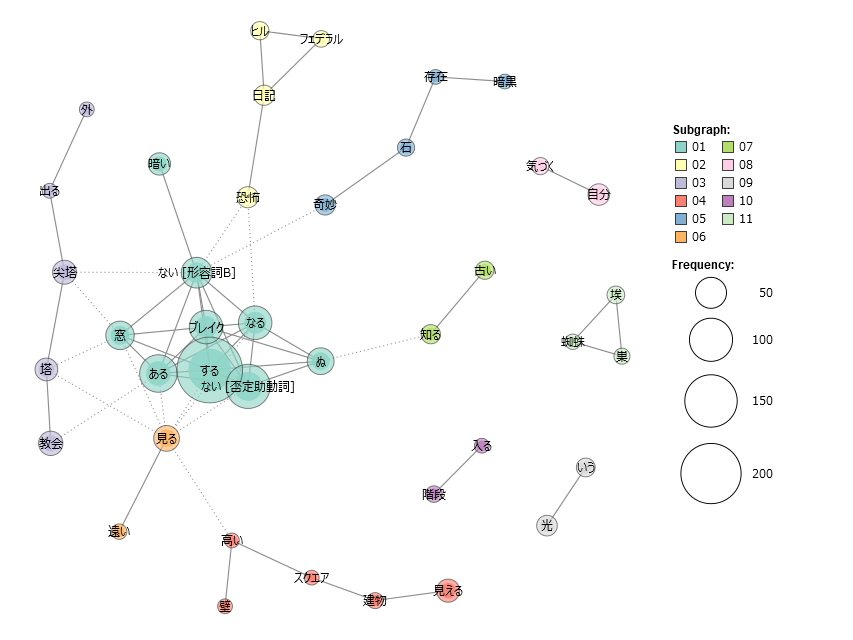
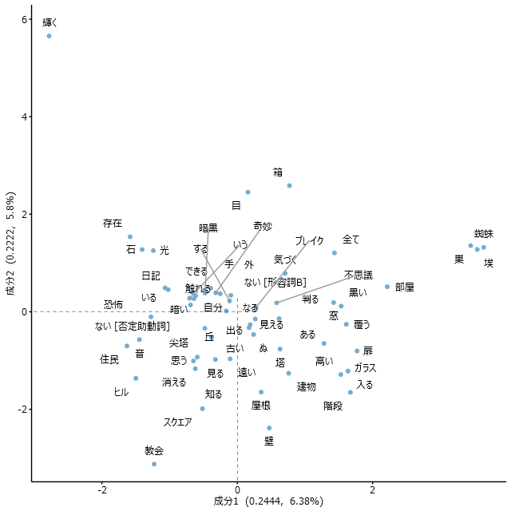
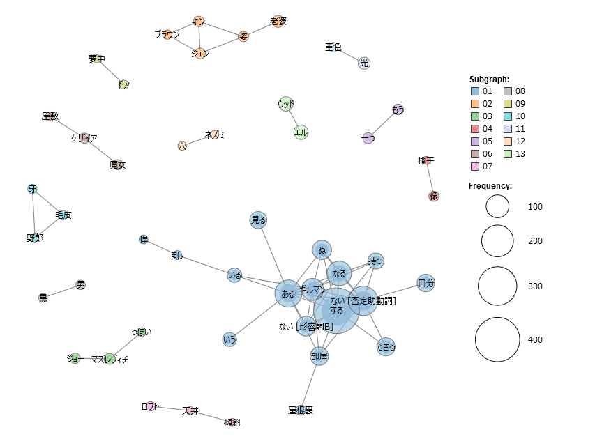
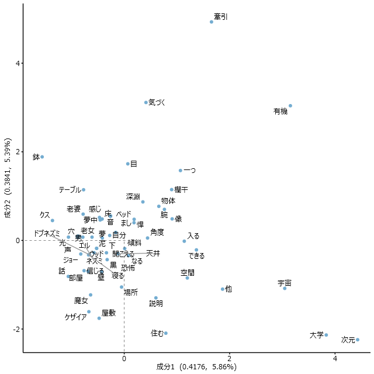

我暗き宇宙の大口を開けるを見たり
そこは暗き惑星のあてどなく廻り
恐怖より目をそらす術も無く廻り
知も光輝も名も無くして廻る場なり
――ネメシス(H. P. ラヴクラフト「闇をさまようもの」より)


DSもくもく会運営部のT.Hです。  
※今回は100%趣味の話です。

# ラヴクラフトの系譜  
[ハワード・フィリップス・ラヴクラフト](https://ja.wikipedia.org/wiki/%E3%83%8F%E3%83%AF%E3%83%BC%E3%83%89%E3%83%BB%E3%83%95%E3%82%A3%E3%83%AA%E3%83%83%E3%83%97%E3%82%B9%E3%83%BB%E3%83%A9%E3%83%B4%E3%82%AF%E3%83%A9%E3%83%95%E3%83%88)という作家をご存じだろうか。  
ラヴクラフトは今から約100年前に怪奇小説を執筆した小説家だ。    
彼の書く特異な世界観は「コズミックホラー」と呼ばれ、後年の作家に大きな影響を与えた。  
ラヴクラフトが作った神々(邪神)とその眷属、架空の地名などの設定は彼の死後に[オーガスト・ダーレス](https://ja.wikipedia.org/wiki/%E3%82%AA%E3%83%BC%E3%82%AC%E3%82%B9%E3%83%88%E3%83%BB%E3%83%80%E3%83%BC%E3%83%AC%E3%82%B9)を始めとした作家仲間によって体系化され、「クトゥルー神話」として今なお多くの作家によってシェアされ続けている。  
クトゥルー神話の紡ぎ手として知られているのは、映画「サイコ」の脚本家として有名な[ロバート・ブロック](https://ja.wikipedia.org/wiki/%E3%83%AD%E3%83%90%E3%83%BC%E3%83%88%E3%83%BB%E3%83%96%E3%83%AD%E3%83%83%E3%82%AF)、タイタス・クロウ・サーガの著者[ブライアン・ラムレイ](https://ja.wikipedia.org/wiki/%E3%83%96%E3%83%A9%E3%82%A4%E3%82%A2%E3%83%B3%E3%83%BB%E3%83%A9%E3%83%A0%E3%83%AC%E3%82%A4)、現代ホラー作家の[スティーヴン・キング](https://ja.wikipedia.org/wiki/%E3%82%B9%E3%83%86%E3%82%A3%E3%83%BC%E3%83%B4%E3%83%B3%E3%83%BB%E3%82%AD%E3%83%B3%E3%82%B0)、日本人作家では[菊地秀行](https://ja.wikipedia.org/wiki/%E8%8F%8A%E5%9C%B0%E7%A7%80%E8%A1%8C)や[朝松健](https://ja.wikipedia.org/wiki/%E6%9C%9D%E6%9D%BE%E5%81%A5)、[小林泰三](https://ja.wikipedia.org/wiki/%E5%B0%8F%E6%9E%97%E6%B3%B0%E4%B8%89)が挙げられる。  
  
# 無貌の神、ニャルラトホテプ
クトゥルー神話にはラヴクラフトが創造した神々が登場するが、その中でも最も特異な神が[ニャルラトホテプ](https://ja.wikipedia.org/wiki/%E3%83%8A%E3%82%A4%E3%82%A2%E3%83%BC%E3%83%A9%E3%83%88%E3%83%86%E3%83%83%E3%83%97)だ。  
ニャルラトホテプは「無貌の神」と形容されるように、特定の姿を持たず登場する作品によって姿や性質が大きく異なる。  
そのため後年の作家も自身の作品に取り入れやすく、ラヴクラフトの死後も様々な設定が追加された。  
初出はラヴクラフトが1920年に執筆した短編小説の「ニャルラトホテプ」であり、この中ではエジプトから来た興行師の姿で現れる(作家の森瀬繚によると当時世界中で興行を行っていたニコラ・テスラがモデルではないかという説がある)。  
ラヴクラフトの他作品「闇をさまようもの」では3眼を持つ異形の姿で登場する。  
ロバート・ブロックの著作では、短編小説「尖塔の影」では核物理学者の姿で登場し、長編小説「アーカム計画」ではカルト教団の指導者として登場する。  
朝松健の短編小説「1989年4月20日」とラヴクラフト著「魔女の家で見た夢」では暗黒の男として現れる。  
余談だが、朝松健の「1989年4月20日」はロンドンで起きた[ホワイトチャペル殺人事件](https://ja.wikipedia.org/wiki/%E3%83%9B%E3%83%AF%E3%82%A4%E3%83%88%E3%83%81%E3%83%A3%E3%83%9A%E3%83%AB%E6%AE%BA%E4%BA%BA%E4%BA%8B%E4%BB%B6)がニャルラトホテプとの共謀犯行という説の元で物語が進行する。犯行の目的は悪魔召喚の儀式であり、全ての儀式(犯行)が終わった翌年の1989年4月20日にアドルフ・ヒトラーの出生届が届られて物語は終わる。

# ニャルラトホテプから見たクトゥルー神話の樹形図
ここからが本題なのだが、これほどまで後年の作家によって脚色されたニャルラトホテプは本来の性質(ラヴクラフトが創作した時点の設定という意味で)を伺い知ることが難しいのではないか。  
もし、最近クトゥルー神話に興味を持った人がいれば、その人が知るニャルラトホテプ像は必ずラヴクラフト以降の脚色されたものである。  
なぜなら、ラヴクラフトが執筆活動を行った数十年より、彼の死後100年の方が時間も執筆量も執筆人数も多く、後年に追加された設定の方が本家より多くなるのは必然だからである。

そこで今回はラヴクラフトの初期作品を分析し、ニャルラトホテプの本来の性質を取り出し、後年作家によってニャルラトホテプがどのように変容していったのか、いわばクトゥルー神話の樹形図を辿ってみたいと思う。

分析手法は以下とする。  
1. 分析に用いるラヴクラフト作品は次の3作品とする  
 ・「ニャルラトホテプ」  
 ・「闇をさまようもの」  
 ・「魔女の家で見た夢」  
 選定理由としては、どの作品にもニャルラトホテプが物語の根幹として登場する。  
 また、これらの作品は[青空文庫](https://www.aozora.gr.jp/)に公開されているため、分析処理が容易に行える。  

2. 分析には[KH Coder](https://khcoder.net/)を使用する  
 文章中の単語同士の繋がりを分析することができる。  
 対応分析と共起ネットワークの可視化により、単語同士の繋がりからラヴクラフト作品ひいてはニャルラトホテプの性質を解読する。

 # 実際に分析してみた

 ### 1. ニャルラトホテプ 
 - 1-1. ニャルラトホテプ_共起ネットワーク
   

      共起ネットワークで注目する点は、右上やや中央寄りの「エジプト」「悪夢」「地」のネットワークである。作中で邪神ニャルラトホテプはエジプトから来たと語られており、まさにエジプトが悪夢を生み出した地として明確に描写されている。  
      エジプトと恐怖の結びつきは後年作家のロバート・ブロックが自作で拡張している。彼の短編小説「無貌の神」はエジプトで異形のスフィンクス像を掘り起こしたことで悪夢に見舞われる内容だ。この話の中で、ニャルラトホテプは顔のないスフィンクスとして登場し、エジプトで過去に崇拝されていた設定が追加されている。  
      「笛」「超える」「太鼓」「音」「手」のネットワークもニャルラトホテプの性質を表していると見て取れる。ラヴクラフトの作中にニャルラトホテプが登場する際、笛の音が伴うことが多いからだ。実際、作中にも以下の描写がある。

     ```
      くぐもる狂おしい太鼓の音、高く単調にかすれゆくこの世ならぬ笛の音。その源は、時の彼方の、人知を超えた、光なき複数の部屋。やがて呪わしい太鼓と笛の音に合わせ、そこでゆるやかに、無様に、そして愚かしく踊るのは、つつやみの、巨大な究極の神々目もなく声もなく、心もない怪物の塊、そいつが化けて現れたものこそ、ニャルラトホテプなのです。(H. P. ラヴクラフト「ニャルラトホテプ」)
     ```

 - 1-2. ニャルラトホテプ_対応分析
 

      対応分析ではこのような結果となった。
      上部には「エジプト」「悪夢」「笛」「太鼓」etc...などニャルラトホテプや作中の描写を特徴づける語群が集まっているが、一方で「ニャルラトホテプ」そのものは中央やや右側に独立して存在している。  
      原因はラヴクラフトの文体であると思われ、「～である。～である。」のように言い切りで区切った文体で描写する特徴がある。また、ニャルラトホテプの名前は一般的な語句でないため、そのままの分析では正確な関連性が現れなかったのではないかと考えられる。  
      右下には「スクリーン」「投影」「怖い」「光景」という語群が見られるが、これは興行師の姿をしたニャルラトホテプが行っていた見世物の内容を表している。  
      ニャルラトホテプが未知の機械を使って恐ろしい光景を投影して見せていたという描写は、後にニャルラトホテプが機械など高度な技術にも精通しているという設定で使われるようになり、ヒュー・B・ケイブの短編小説「臨終の看護」ではニャルラトホテプが無線通信機器の波長を捉えて応答するシーンがある。

 ### 2. 闇をさまようもの 
 - 2-1. 闇をさまようもの_共起ネットワーク
  

      やはり、注目すべきは「奇妙」「石」「存在」「暗黒」の繋がったネットワークであろう。  
      この物語は、境界の尖塔で見つけた奇妙な石を見つめてしまったことが起因し、別次元の暗黒の存在を呼び出してしまうという概要だ。  
      この暗黒の存在こそ、燃える三眼として顕現したニャルラトホテプである。
      また、興味深いのが「暗黒」の「存在」(ニャルラトホテプ)と「教会」が弱い関係性でつながっていることだ。  
      この関係性を強めた作家がまたしてもロバート・ブロックであり、彼の著作「アーカム計画」はラヴクラフトの「闇をさまようもの」の続編的な立ち位置である。ロバート・ブロックは、本作に登場する教会がカルト教団「星の智慧派」によって建てられたものであるという設定を加え、さらに星の智慧派の指導者としてニャルラトホテプを登場させている(作中の名前はナイ神父)。  
      「アーカム計画」で共起ネットワークを描画すると、「教会」とニャルラトホテプの関係は強い結果となるかもしれない。

 - 2-2. 闇をさまようもの_対応分析
  

     注目すべきは「箱」と「石」の位置である。  
     対応分析は特徴的な単語ほど原点から遠くにプロットされる特徴があり、それに倣うと「箱」は「石」より特徴的である。  
     しかし、「石」は後年作品によってトラペゾヘドロンという名が与えられ、クトゥルー神話の重要なアイテムとして認知されている。  
     一方で「箱」はさほど重要なアイテムとされていない。  
     作中では、「箱」の描写が鮮明に描写されており、グロテスクな彫刻が施されている点や中に収められている石(トラペゾヘドロン)を三本の支柱で支えているなどかなり特徴的な形状が伺える。  
     これほど特徴的なアイテムに関わらず、後年作家に着目されなかったのは意外である。
。 
 ### 3. 魔女の家で見た夢 
  - 3-1. 魔女の家で見た夢_共起ネットワーク
 

       人物名が姓名で別単語と認識されており、結果としては些か不完全ではあるものの、「黒」「男」のニャルラトホテプを象徴するネットワークが確認できる。
  - 3-2. 魔女の家で見た夢_対応分析


       共起ネットワークで確認できたニャルラトホテプを象徴する単語「黒」「男」の近くに「老女」「老婆」という単語が存在する。  
       物語中では、夢の中に黒い男(ニャルラトホテプ)と共に魔女の老婆が現れる。  
       「魔女」という単語が離れてしまっているが、文章中に直接的に`老婆=魔女`という表現が無いためだろう。  
       「黒い男」をイメージしてもらえば、たしかに不気味であるが邪神のような禍々しさまでは感じないかもしれない。  
       しかし、文化人類学者のマーガレット・マーレーによると魔女の魔宴(サバト)に出現した悪魔がいづれも黒い服を着た長身の浅黒いおことであったと記録が残っている(朝松健「邪神帝国」内の注釈より)。  
       その意味で、魔女と共に出現する黒い男は悪魔のような禍々しさを持つ、まさしく邪神のような存在である。

# 最後に
今回はH.P.ラヴクラフトの著作のうち、ニャルラトホテプを主題とする3作をテキスト分析し、クトゥルー神話の源泉と発展を考察した。  
もちろん、今回の分析結果はあくまで1つの解釈に過ぎず、クトゥルー神話には無限の見方、読み方があってよいと思う。  
しかし、ラヴクラフトは神話と呼ばれるほど広大な世界観を創り出した作家のため、各作品には少なからず繋がりがあるため、分析しがいのある作家ではないだろうかと思う。  

2024年1月某日  
『カラー・アウト・オブ・スペース -遭遇-』を観ながら