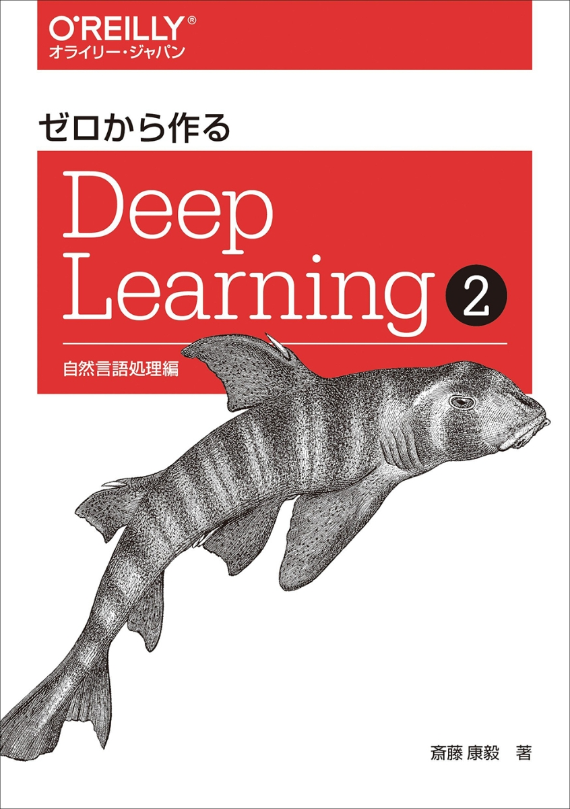

お疲れ様です。

DSもくもく会運営部のS.Kです。

今回は技術書紹介になります。

# 紹介本
1.ゼロから作るDeepLearning2

2.ゼロから作るDeepLearning5

## ゼロから作るDeepLearning2
### 書籍情報
**著者：** 斎藤康毅

**出版社：** オライリージャパン

[☞リンク](https://www.oreilly.co.jp/books/9784873118369/)

名著「ゼロから作るDeepLearning」シリーズの2巻になります。

1巻では主にニューラルネットワークの実装がメインとなっていました。

本書は1巻のおさらいに加えて、自然言語処理で使われる手法やモデルにフォーカスを当てて紹介されています。

単語の分散表現(カウントベース, Word2Vec), 時系列処理(RNN), 機械翻訳モデルと文章生成モデル(LSTM, seq2seq, attention)などを詳細に解説しており、私も研究室時代にとてもお世話になった本です。

刊行年が2018年のために現在からみると若干古い技術の解説となってはしまっていますが、

それでも昨今隆盛であるChatGPTといったLLMの仕組みを理解するうえでもベースとなる今なお参考になる本なので非常におすすめです。

## ゼロから作るDeepLearning5
※著者, 出版社は上記と同じのため省略

**発売日：** 2024/4/25

[☞リンク](https://note.com/koki0702/n/n546324125e93)

[☞Github(本書で使用のソース)](https://github.com/oreilly-japan/deep-learning-from-scratch-5)

人気シリーズ待望の第5巻が今年の4月にリリースされます。

ゼロから作るシリーズは刊行の前に公開レビューがされることがあり、この5巻についても昨年12月中旬の期間限定で実施されていました。

<blockquote class="twitter-tweet">
『ゼロから作るDeep Learning ❺ ―生成モデル編』公開レビュー中です。  残り 2週間 となりました。引き続きよろしくお願いします！<a href="https://t.co/sfErU8k5tp">https://t.co/sfErU8k5tp</a>
&mdash; Koki Saitoh 斎藤康毅 (@SaitohKoki) <a href="https://twitter.com/SaitohKoki/status/1730868206280249533?ref_src=twsrc%5Etfw">December 2, 2023</a></blockquote> 

私もレビュー公開中に中身を参照させていただきましたが、

正規分布~二項分布, 中心極限定理といったデータサイエンスにおける重要な概念を基礎から丁寧に解説されていたのに加え、画像生成モデルの仕組みであるガウシアンノイズについての解説が続き、

最後に簡単な画像生成モデルの作成と非常に面白い内容となっておりました。

# おわりに
現在実施している「言語処理編」では回を進むごとに2巻内容も取り上げて説明していきます。

また5巻については購入予定で、DSもくもく会でもアウトプットを出せればと思っています。